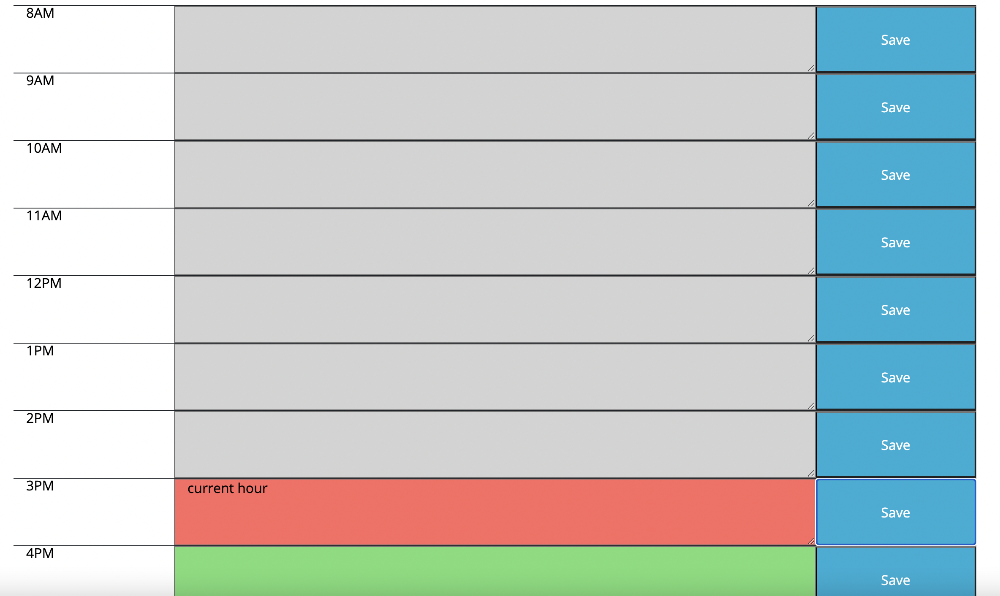
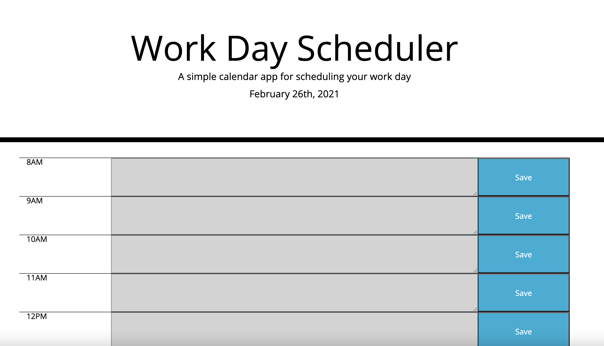

# work_day_scheduler
My fifth [repository](##) on Github.
# Description
Application was built using Javascript & JQuery, HTML, CSS, Bootstrap 4,  https://devhints.io/moment library. This calendar app allows the user to track all events for each hour of the day. The application displays business hours (8 a.m. to 4 p.m.). Schedule boxes are colored as current, present and future time. The time in the past is colored in grey, the time frame in which user is currently  in, is  colored in red and the future time in green. Every time the user brings up the calendar current time is reflected in real time.

Clicking on the save button will store the time and user input in localStorage.
# Installation
Please visit the deployed project at: ##.
